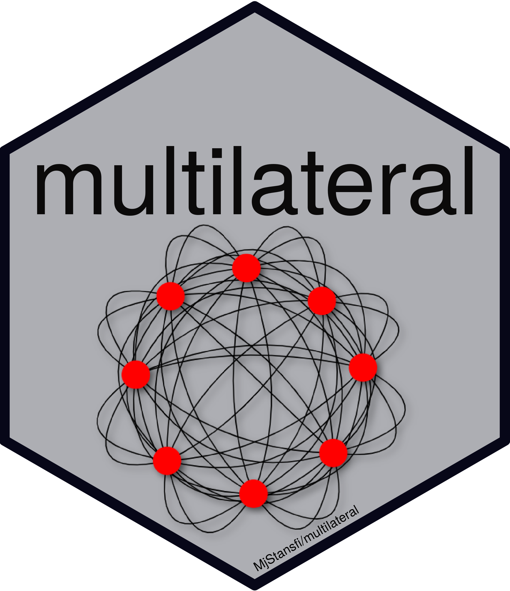
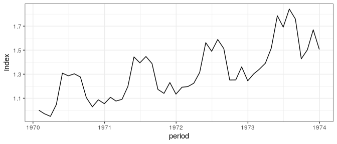
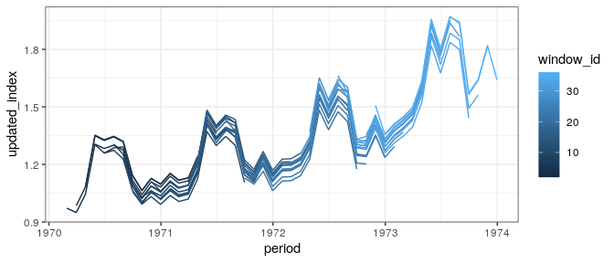
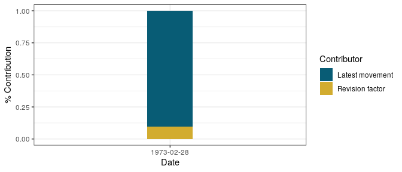

# Multilateral 

<!-- badges: start -->

[](https://github.com/MjStansfi/multilateral/actions)

[](https://www.r-pkg.org/badges/version/multilateral)

<!-- badges: end -->

## Overview

The multilateral package provides one key function, that is
`multilateral()`. The user provides the necessary attributes of a
dataset to calculate their choice of multilateral methods.

See
[vignette](https://htmlpreview.github.io/?https://github.com/MjStansfi/multilateral/blob/main/doc/multilateral.html)
for further information.

For some specific index calculation methods this package has been
heavily influenced by Graham White’s [IndexNumR
package](https://github.com/grahamjwhite/IndexNumR).

## Installation

``` r
devtools::install_github("StatisticsNZ/multilateral")

library(multilateral)
```

## Usage

See bottom for all index and splice methods.

``` r
library(multilateral)
library(ggplot2)

tpd_index <- multilateral(period = turvey$month,
                          id = turvey$commodity,
                          price = turvey$price,
                          quantity = turvey$quantity,
                          splice_method = "geomean",
                          window_length = 13,
                          index_method = "TPD")

plot <- ggplot(tpd_index$index)+geom_line(aes(x = period, y = index))+theme_bw()

print(plot)
```

<!-- -->

## Further detail

The function returns a list object containing

  - `index`: the continuous spliced index,
  - `index_windows`: each individual window’s index,
  - `splice_detail`: splicing information.

<!-- end list -->

``` r
str(tpd_index) 
#> List of 3
#>  $ index        :Classes 'data.table' and 'data.frame':  48 obs. of  3 variables:
#>   ..$ period   : Date[1:48], format: "1970-01-31" "1970-02-28" ...
#>   ..$ index    : num [1:48] 1 0.971 0.949 1.047 1.308 ...
#>   ..$ window_id: int [1:48] 1 1 1 1 1 1 1 1 1 1 ...
#>   ..- attr(*, ".internal.selfref")=<externalptr> 
#>  $ index_windows:Classes 'data.table' and 'data.frame':  468 obs. of  3 variables:
#>   ..$ period   : Date[1:468], format: "1970-01-31" "1970-02-28" ...
#>   ..$ index    : num [1:468] 1 0.971 0.949 1.047 1.308 ...
#>   ..$ window_id: int [1:468] 1 1 1 1 1 1 1 1 1 1 ...
#>   ..- attr(*, ".internal.selfref")=<externalptr> 
#>  $ splice_detail:Classes 'data.table' and 'data.frame':  35 obs. of  5 variables:
#>   ..$ period                : Date[1:35], format: "1971-02-28" "1971-03-31" ...
#>   ..$ latest_window_movement: num [1:35] 0.97 1.012 1.097 1.195 0.949 ...
#>   ..$ revision_factor       : num [1:35] 1 1 1 1.01 1.02 ...
#>   ..$ update_factor         : num [1:35] 0.972 1.013 1.099 1.205 0.966 ...
#>   ..$ window_id             : int [1:35] 2 3 4 5 6 7 8 9 10 11 ...
#>   ..- attr(*, ".internal.selfref")=<externalptr> 
#>  - attr(*, "class")= chr [1:2] "list" "multilateral"
#>  - attr(*, "params")=List of 6
#>   ..$ index_method    : chr "TPD"
#>   ..$ window_length   : num 13
#>   ..$ splice_method   : chr "geomean"
#>   ..$ chain_method    : NULL
#>   ..$ check_inputs_ind: logi TRUE
#>   ..$ matched         : NULL
```

The `index_windows` returns all individual windows indexes before they
were spliced. Below shows how you could (roughly) visualise this data

``` r
library(dplyr)
#> 
#> Attaching package: 'dplyr'
#> The following objects are masked from 'package:stats':
#> 
#>     filter, lag
#> The following objects are masked from 'package:base':
#> 
#>     intersect, setdiff, setequal, union

#Get splice details to relevel each new index
update_factor <- tpd_index$splice_detail%>%
  mutate(update_factor  = cumprod(update_factor))%>%
  select(window_id, update_factor)


index_windows <- merge(tpd_index$index_windows,update_factor)

index_windows <-index_windows%>%mutate(updated_index = index*update_factor)
windows_plot <- ggplot(index_windows)+
  geom_line(aes(x = period, y = updated_index, group = window_id, colour = window_id))+
  theme_bw()

print(windows_plot)
```

<!-- -->

`splice_detail` gives the user a break down of how the given periods
index number is made up of both a ‘revision factor’ (from splicing) and
the latest periods movement. This can be useful for diagnostics.

``` r
head(tpd_index$splice_detail)
#>        period latest_window_movement revision_factor update_factor window_id
#> 1: 1971-02-28              0.9698029        1.002095     0.9718351         2
#> 2: 1971-03-31              1.0120421        1.001120     1.0131760         3
#> 3: 1971-04-30              1.0973656        1.001151     1.0986290         4
#> 4: 1971-05-31              1.1950159        1.008111     1.2047081         5
#> 5: 1971-06-30              0.9490383        1.017805     0.9659356         6
#> 6: 1971-07-31              1.0336941        1.004028     1.0378582         7
```

Below shows one way in which you could visualise contribution of
revision factor verses the latest movement.

``` r
library(dplyr)

#Period of interest
splice_detail <- tpd_index$splice_detail[period=="1973-02-28"]

#Log information to determine contribution
lwm_log <- log(splice_detail$latest_window_movement)
rf_log <- log(splice_detail$revision_factor)
sum_log <- sum(lwm_log+rf_log)

lwm_contrib <- lwm_log/sum_log
rf_contrib <- rf_log/sum_log


ggplot(mapping = aes(fill=c("Latest movement","Revision factor"),
                     y=c(lwm_contrib,rf_contrib),
                     x="1973-02-28"))+
  geom_bar(position="stack", stat="identity", width = 0.2)+
  theme_bw()+
  xlab("Date")+
  ylab("% Contribution")+
  labs(fill = "Contributor")+
  scale_fill_manual(values = c("#085c75","#d2ac2f"))
```

<!-- -->

## Options

See
[vignette](https://htmlpreview.github.io/?https://github.com/MjStansfi/multilateral/blob/main/doc/multilateral.html)
for further information.

<table class="table" style="font-size: 12px; margin-left: auto; margin-right: auto;">

<thead>

<tr>

<th style="text-align:left;">

Method

</th>

<th style="text-align:left;">

Name

</th>

<th style="text-align:left;">

Requires ID

</th>

<th style="text-align:left;">

Requires Features

</th>

<th style="text-align:left;">

Requires Quantity

</th>

<th style="text-align:left;">

Requires Weight

</th>

<th style="text-align:left;">

Can Restrict to Matched Sample

</th>

</tr>

</thead>

<tbody>

<tr>

<td style="text-align:left;">

TPD

</td>

<td style="text-align:left;">

Time Product Dummy

</td>

<td style="text-align:left;">

TRUE

</td>

<td style="text-align:left;">

FALSE

</td>

<td style="text-align:left;">

FALSE

</td>

<td style="text-align:left;">

TRUE

</td>

<td style="text-align:left;">

FALSE

</td>

</tr>

<tr>

<td style="text-align:left;">

TDH

</td>

<td style="text-align:left;">

Time Dummy Hedonic

</td>

<td style="text-align:left;">

FALSE

</td>

<td style="text-align:left;">

TRUE

</td>

<td style="text-align:left;">

FALSE

</td>

<td style="text-align:left;">

TRUE

</td>

<td style="text-align:left;">

FALSE

</td>

</tr>

<tr>

<td style="text-align:left;">

GEKS-J

</td>

<td style="text-align:left;">

GEKS Jevons

</td>

<td style="text-align:left;">

TRUE

</td>

<td style="text-align:left;">

FALSE

</td>

<td style="text-align:left;">

FALSE

</td>

<td style="text-align:left;">

FALSE

</td>

<td style="text-align:left;">

TRUE

</td>

</tr>

<tr>

<td style="text-align:left;">

GEKS-T

</td>

<td style="text-align:left;">

GEKS Tornqvist

</td>

<td style="text-align:left;">

TRUE

</td>

<td style="text-align:left;">

FALSE

</td>

<td style="text-align:left;">

TRUE

</td>

<td style="text-align:left;">

FALSE

</td>

<td style="text-align:left;">

TRUE

</td>

</tr>

<tr>

<td style="text-align:left;">

GEKS-F

</td>

<td style="text-align:left;">

GEKS Fisher

</td>

<td style="text-align:left;">

TRUE

</td>

<td style="text-align:left;">

FALSE

</td>

<td style="text-align:left;">

TRUE

</td>

<td style="text-align:left;">

FALSE

</td>

<td style="text-align:left;">

TRUE

</td>

</tr>

<tr>

<td style="text-align:left;">

GEKS-IT

</td>

<td style="text-align:left;">

GEKS Imputation Tornqvist

</td>

<td style="text-align:left;">

TRUE

</td>

<td style="text-align:left;">

TRUE

</td>

<td style="text-align:left;">

TRUE

</td>

<td style="text-align:left;">

FALSE

</td>

<td style="text-align:left;">

TRUE

</td>

</tr>

</tbody>

</table>

<table>

<thead>

<tr>

<th style="text-align:left;">

splice\_method

</th>

</tr>

</thead>

<tbody>

<tr>

<td style="text-align:left;">

geomean

</td>

</tr>

<tr>

<td style="text-align:left;">

window

</td>

</tr>

<tr>

<td style="text-align:left;">

movement

</td>

</tr>

<tr>

<td style="text-align:left;">

geomean\_short

</td>

</tr>

<tr>

<td style="text-align:left;">

half

</td>

</tr>

</tbody>

</table>

<table>

<thead>

<tr>

<th style="text-align:left;">

chain\_method

</th>

</tr>

</thead>

<tbody>

<tr>

<td style="text-align:left;">

geomean

</td>

</tr>

<tr>

<td style="text-align:left;">

window

</td>

</tr>

<tr>

<td style="text-align:left;">

movement

</td>

</tr>

<tr>

<td style="text-align:left;">

half

</td>

</tr>

</tbody>

</table>
